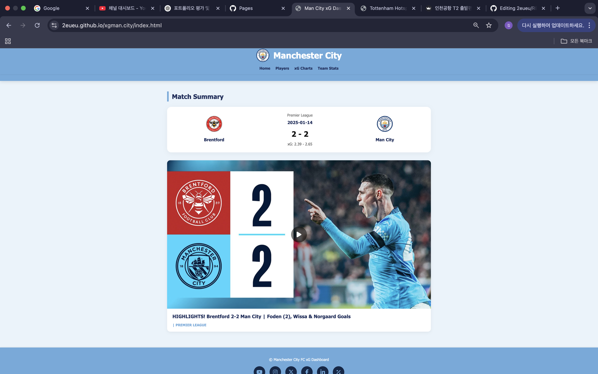
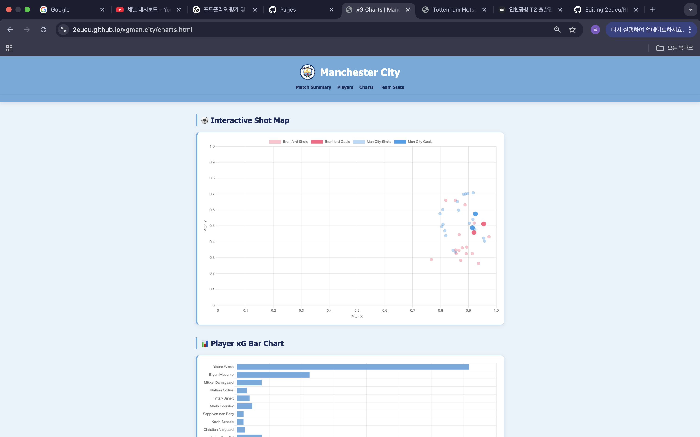
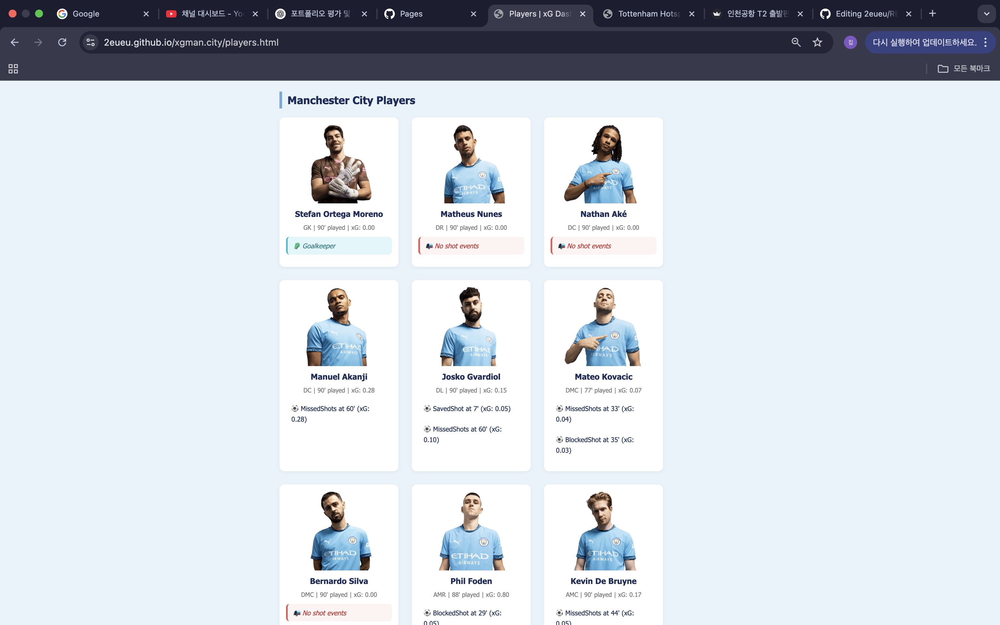
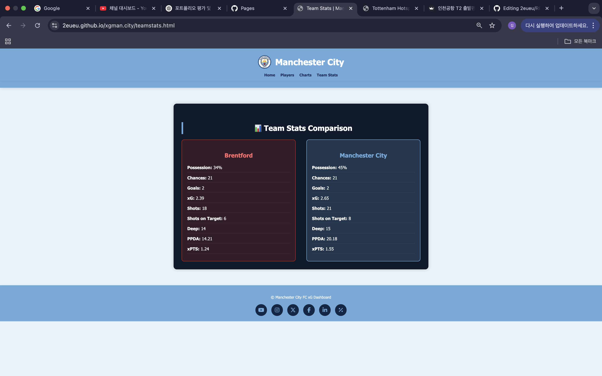

# xGMan.City – Football Team Stats Dashboard

>  **[Live Demo](https://2eueu.github.io/xgman.city/teamstats.html)**  
> A football data dashboard visualizing team & player performance based on expected goals (xG)

---

##  Overview

This dashboard analyzes and visualizes football stats (especially xG) using interactive visualizations and a clean UI.  
It supports club-level team stat analysis and player-level shot maps to support tactical evaluation.

---

## Preview

| Team Dashboard (`main.png`) | xG Timeline (`charts1.png`) |
|-----------------------------|------------------------------|
|  |  |

| Shot Map (`mcplayers.png`) | Summary Stats (`stats.png`) |
|----------------------------|------------------------------|
|  |  |

---

##  Features

-  **Expected Goals (xG)** comparison by teams
-  Player-specific shot heatmaps and outcomes
-  Real-time chart visualizations using Chart.js
-  Simple, mobile-friendly layout (pure HTML/CSS/JS)

---

##  Tech Stack

---

## Concepts Used

-  xG modeling & tactical data visualization
-  Filtering codeshare vs. master flights (for sports usage too)
-  Dashboard-style user experience design

---

##  Related Work

- [xGMan.City Player View (WIP)](https://2eueu.github.io/xgman.city/playerview.html)
- [Tottenham Shop Clone](https://2eueu.github.io/spurs-shop-clone/)

---

##  About the Creator

-  **Name**: GaEun Lee (이가은)  
-  **Major**: Artificial Intelligence Engineering  
-  **Interests**: Sports analytics, xG modeling, and EPL scouting tools

---

## 📄 License

MIT License © 2025 GaEun Lee ([@2eueu](https://github.com/2eueu))
